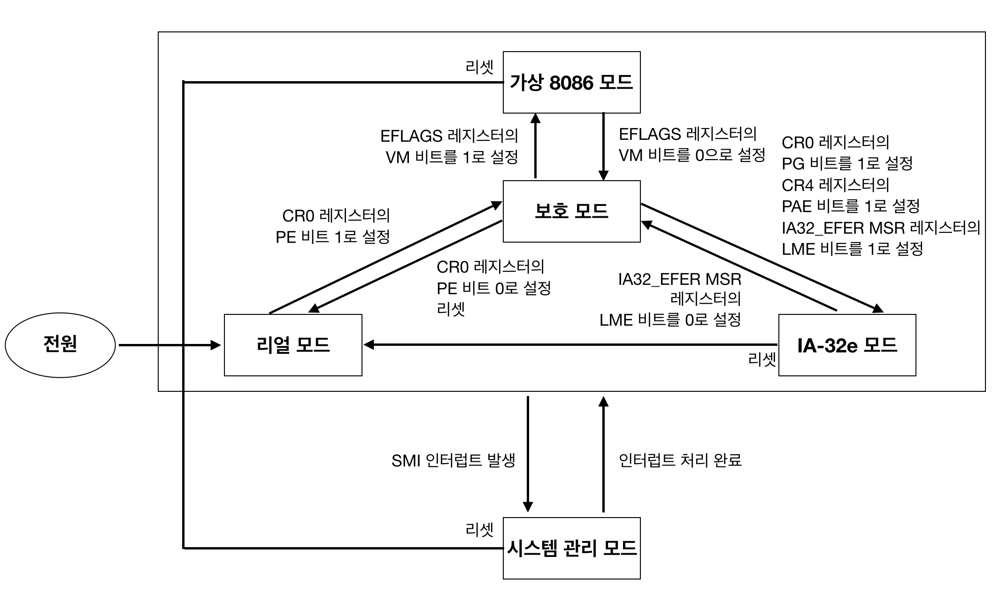
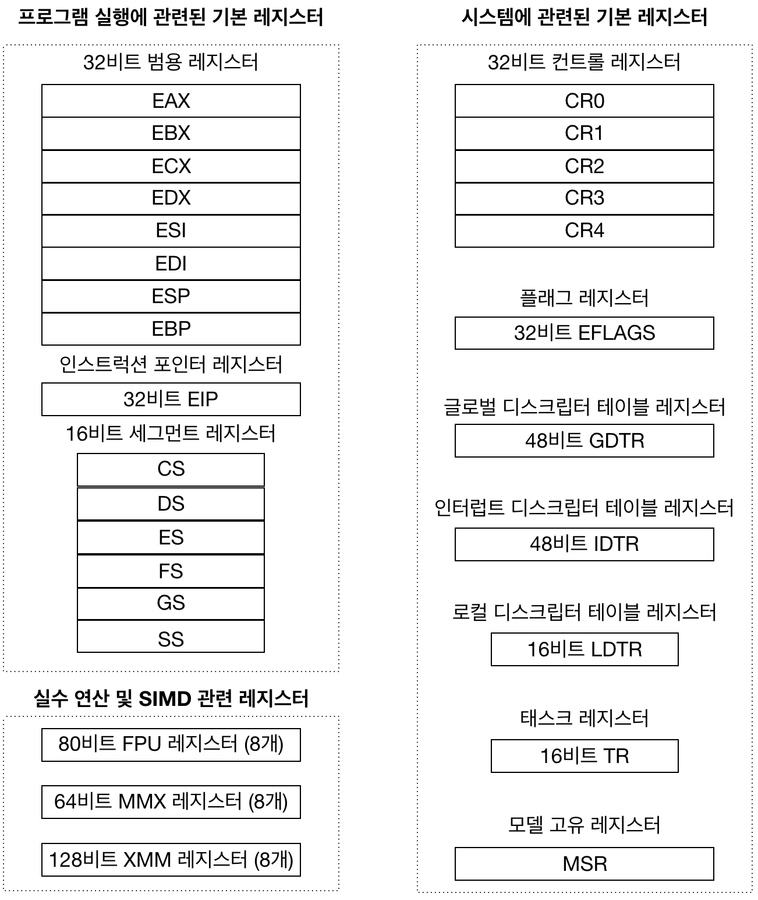
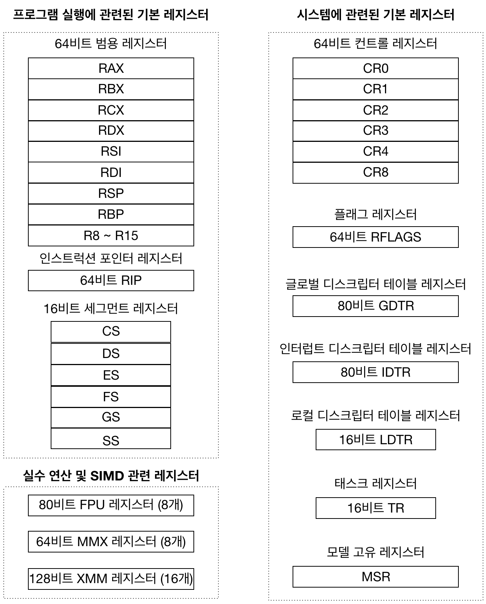

# 64비트 프로세서의 이모저모

## 운영 모드

  x86-64 프로세서는 다섯 가지 운영모드가 있다.

  | 운영모드 | 설명 |
  |:--:|:--:|
  | 리얼 모드 | - 프로세서의 초기 상태로서 16비트 모드로 동작하며 8086 프로세서아 호환되는 모드   - 최대 1MB(220)의 주소 공간을 지원 |
  | 보호 모드 | - 32비트 모드로 동작하며 세그먼트, 페이징, 보호, 멀티태스킹 등의 기능을 제공하는 모드   - 4GB(232)의 주소 공간을 지원 |
  | IA-32e 모드 | - 32비트 호환 모드와 64비트 모드의 두 가지 서브모드로 구성   - 16EB(264)의 주소 공간을 지원 |
  | 시스템 관리 모드 | - 전원 관리나 하드웨어 제어 같은 특수 기능을 제공하는 모드 |
  | 가상 8086 모드 | - 보호 모드 내부에서 가상의 환경을 설정하여 리얼 모드처럼 동작하는 모드 |

### 운영 모드 사이의 관계와 운영 모드의 전환

  | 운영 모드 전환 다이어그램 |
  |:--:|
  |  |

  * 처음 전원이 켜지거나 리셋되면 프로세서는 리얼 모드로 진입
  * 리얼 모드에서 전환할 수 있는 모드는 공식적으로 보호모드가 유일
  * 보호 모드에서는 가상 8086 모드, IA-32e 모드, 리얼 모드로 전환 가능
  * 시스템 관리 모드는 모든 모드에서 진입 가능

## 운영 모드와 레지스터

  | 보호 모드의 레지스터 |
  |:--:|
  |  |

  | IA-32e 모드의 레지스터 |
  |:--:|
  |  |

### 범용 레지스터 (General Purpose Register)

  계산, 메모리 어드레스 지정, 임시 저장 공간 등의 목적으로 사용한다.  
  범용 레지스터의 수가 늘어나면 수행 속도가 개선된다는 장점이 있다.

  | 범용 레지스터 이름 | 용도 |
  |:--:|:--:|
  | AX | 산술 연산을 수행할 때 누산기로 사용 |
  | BX | 데이터의 어드레스를 지정할 때 데이터 포인터로 사용 |
  | CX | 루프 또는 문자열의 카운터로 사용 |
  | DX | I/O 에드레스를 지정할 때 사용되며, 산술 연산을 수행할 때 보조 레지스터로 사용 |
  | SI | 문자열에 관련된 작업을 수행할 때 원본 문자열의 인덱스로 사용 |
  | DI | 문자열에 관련된 작업을 수행할 때 목적지 문자열의 인덱스로 사용 |
  | SP | 스택의 포인터로 사용 |
  | BP | 스택의 데이터에 접근할 때 데이터의 포인터로 사용 |
  | R8 ~ R15 | x86-64 프로세서에서 추가된 범용 레지스터로, 다양한 용도로 사용 가능 |

### 세그먼트 레지스터

### 컨트롤 레지스터

## 운영 모드와 메모리 관리 기법
